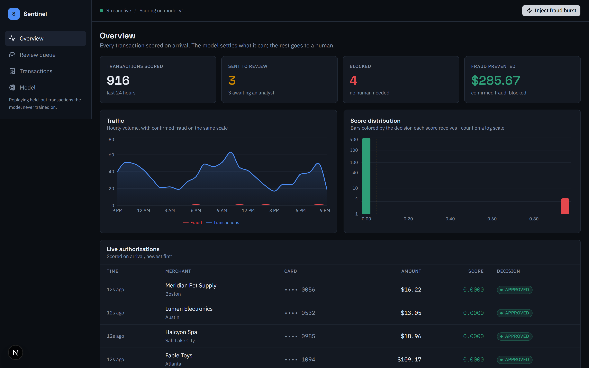
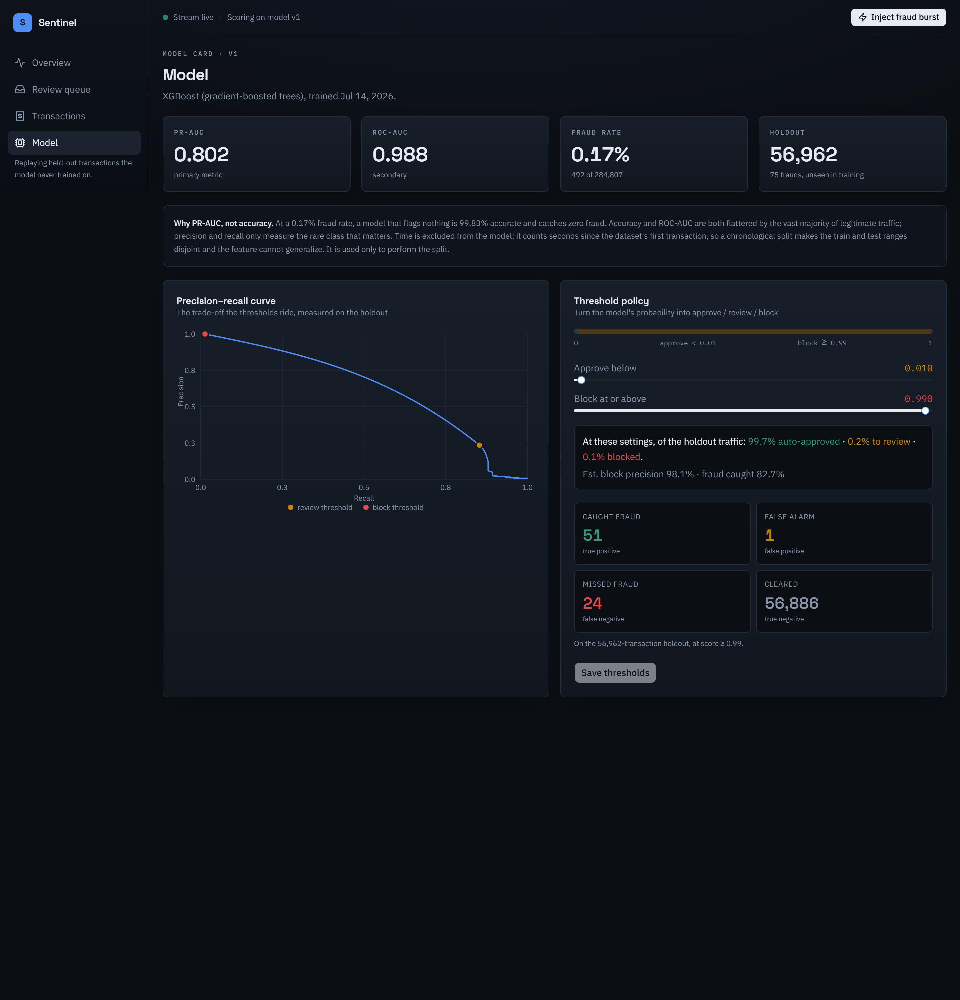
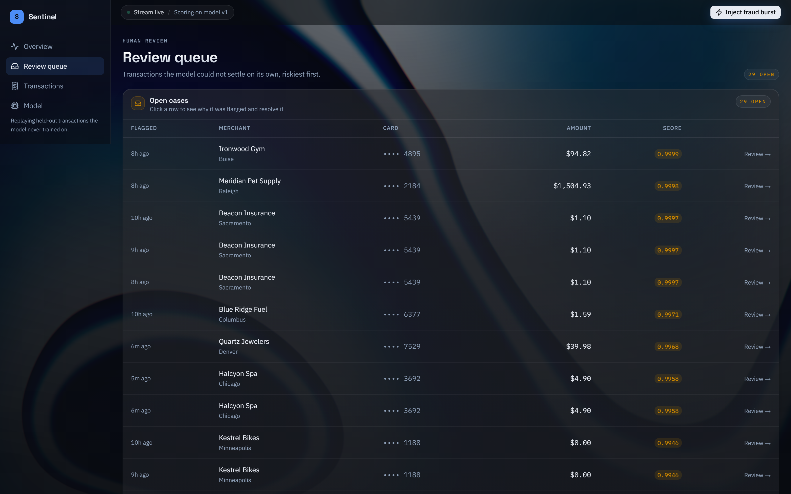
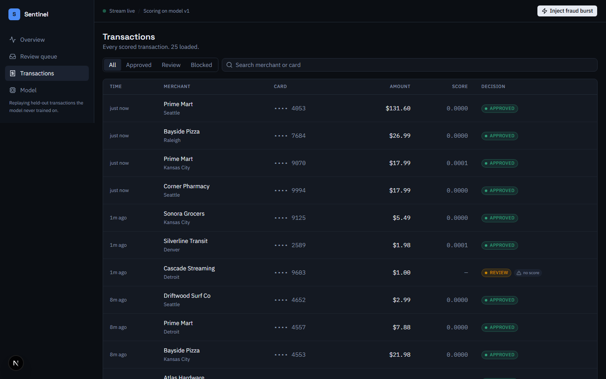

# Sentinel — real-time payment fraud detection

**Live demo → [sentinel-fraud-console.vercel.app](https://sentinel-fraud-console.vercel.app)**
· Click **Inject fraud burst** and watch the system catch it.

Sentinel is the operational system a payments company runs around a fraud model:
every transaction is scored on arrival, the confident cases are auto-approved or
auto-blocked, and the uncertain ones are routed to a human analyst with an
explanation of why they were flagged. It is a full-stack application with a
genuinely trained model at its core — not a notebook, and not a wrapper around a
chat API.



---

## Using the demo

Open the [live demo](https://sentinel-fraud-console.vercel.app) and walk the four pages.
The **Inject fraud burst** button in the top bar pushes through a batch of
transactions that is guaranteed to contain real fraud, so you can watch the
system catch it on demand.

1. **Overview** — the live operations dashboard. KPI tiles (scored, reviewed,
   blocked, fraud prevented), a traffic chart with the fraud line near zero (that
   flat line is the point — fraud is 0.17% of volume), a bimodal score
   distribution, and a live feed of scored transactions.
   → *Click **Inject fraud burst** and watch red `BLOCKED` rows appear with scores near 1.0.*
2. **Review queue** — transactions the model wasn't confident enough to auto-decide.
   Click a row to open the drawer: the score, the policy band it landed in, and
   the top factors that flagged it. Add a note and hit **Approve** or **Block**.
   → *This is the human-in-the-loop step; resolving a case removes it from the queue.*
3. **Transactions** — the full searchable ledger. Filter by decision
   (All / Approved / Review / Blocked), search by merchant or card, and page
   through history.
4. **Model** — the model card: PR-AUC / ROC-AUC, a "why PR-AUC not accuracy"
   explainer, the precision–recall curve with the thresholds marked, and global
   feature importance. The **threshold sliders** are live — drag one, watch the
   projected approve/review/block split update, then **Save** and the system
   decides new transactions by your policy.

> The first click on a page may take a second (serverless cold start) — it warms
> up after the first visit.

**Two-minute interview flow:** open on Overview → Inject fraud burst → point at a
blocked row → open a case in the Review queue → show the threshold tuner on the
Model page. What you show mirrors what you say.

---

## What it does

- **Scores every transaction in ~2 ms** with a gradient-boosted model served as
  ONNX, and records the probability, the decision, and a per-transaction
  explanation.
- **Turns probability into policy** with two tunable thresholds — approve below
  the first, block above the second, send the middle to a human. The thresholds
  are a live control, because where they sit is a business decision (fraud loss
  vs. customer friction), not a model constant.
- **Puts a human in the loop.** Flagged transactions land in a review queue where
  an analyst sees the score, the factors that drove it, and Approve / Block
  actions with a full audit trail.
- **Explains itself.** Global feature importance (exact SHAP) on the model page;
  per-transaction attributions (fast sensitivity analysis) in the review drawer.
- **Fails safe.** If the scorer is unreachable, the transaction is still recorded
  and routed to a human — never silently approved, never auto-blocked without a
  score.

## The model

Trained on the [ULB credit-card fraud dataset](https://www.openml.org/d/1597):
284,807 real anonymized transactions, 492 of them fraudulent — a **0.173%**
positive rate. That extreme imbalance is the whole difficulty, and it drives
every modeling decision.

| | |
|---|---|
| Algorithm | XGBoost (gradient-boosted trees), 232 rounds, depth 8 |
| **PR-AUC (holdout)** | **0.802** |
| ROC-AUC (holdout) | 0.988 |
| Evaluation split | Time-based — train on the past, test on the future |
| Holdout | 56,962 transactions, 75 frauds, never seen in training |

Operating points on the future holdout:

| Threshold | Precision | Recall | Caught | False positives |
|---|---|---|---|---|
| 0.01 (approve line) | 0.34 | 0.83 | 62 / 75 | 121 |
| 0.50 | 0.89 | 0.75 | 56 / 75 | 7 |
| 0.99 (block line) | 0.98 | 0.68 | 51 / 75 | 1 |

### Design decisions worth defending

- **PR-AUC, not accuracy.** At a 0.17% fraud rate a model that flags nothing is
  99.83% accurate and catches zero fraud. ROC-AUC is similarly flattered by the
  vast true-negative mass. Precision and recall only measure the rare class that
  matters.
- **Time-based split.** A random split lets the model learn from transactions
  that happen *after* the ones it is tested on — a leak that inflates every
  metric. Fraud is deployed against the future, so it is measured against the
  future.
- **`Time` is not a feature.** It counts seconds since the dataset's first
  transaction, so a chronological split leaves the train and test ranges disjoint
  by construction and the trees cannot generalize on it. Dropping it raised
  holdout PR-AUC from 0.7995 to 0.8019. It is used only to perform the split.
- **Thresholds as a business dial.** Defaults are derived from operating
  constraints — analyst queue capacity sets the approve line, block precision
  sets the block line — and are re-tunable live in the UI.
- **ONNX serving.** The model is trained with the full XGBoost/SHAP stack locally,
  then exported to a ~0.8 MB ONNX artifact that the serving function runs with
  only `onnxruntime`. Training and serving are provably the same model — export
  refuses to write an artifact whose predictions drift from the trained one
  (measured drift: 1.2e-7).
- **Cost-sensitive learning over resampling.** The imbalance is handled with
  `scale_pos_weight` so the model still sees the real data distribution.



## Architecture

```
┌─────────────────────────── Vercel ───────────────────────────┐
│  Next.js (App Router, TypeScript, Tailwind, Recharts)         │
│   ├─ Overview · Review queue · Transactions · Model           │
│   └─ Node API routes: ingest, feed, stats, cases, settings    │
│                     │  rewrite /api/py/*                       │
│                     ▼                                          │
│  Python function (FastAPI + onnxruntime)                      │
│   └─ POST /api/py/score → { probability, topFactors[] }       │
└──────────────────────────┬────────────────────────────────────┘
                           ▼
                 Postgres (Neon in prod · PGlite locally)

Local, run once per model version:
  ml/  download → train → export → make_replay
       → models/v1/{model.onnx, metrics.json, shap_summary.json, …}
```

- **One repo, one Vercel deployment.** The Next.js app and the Python scorer ship
  together; the app reaches the model through its own origin.
- **Ingest is the write path**: score → decide → persist the transaction and, if
  it needs review, its case — atomically, and idempotently by a client-supplied
  id so a retry can't double-count.
- **The live demo is honest.** The simulator replays held-out test transactions
  the model never trained on, so every score on screen is a real out-of-sample
  prediction. Traffic is presence-driven — the stream advances while someone is
  watching, throttled server-side so N open tabs still produce one batch per
  interval.



## Tech stack

- **Model** — Python, XGBoost, scikit-learn, ONNX, SHAP
- **Serving** — FastAPI, onnxruntime, NumPy
- **App** — Next.js, TypeScript, Tailwind, shadcn/ui, Recharts
- **Data** — Drizzle ORM, Neon Postgres (prod), PGlite (local)
- **Tests** — pytest, Vitest, Playwright

## Running it locally

Prerequisites: Node 20+, Python 3.11+, pnpm.

```bash
pnpm install
python -m pip install -r requirements.txt -r ml/requirements.txt

# The trained model and replay data are committed, so this is optional.
# To reproduce the model from scratch (downloads the dataset, ~1-4 min):
pnpm ml:all

# Set up the local database (PGlite — no server or credentials needed):
pnpm db:migrate
pnpm db:seed

# Start the app (Next.js + the Python scorer together):
pnpm dev
# → http://localhost:3000

# Optional: give the dashboard a day of history to display
pnpm db:backfill   # requires the dev server to be running
```

> Local development uses PGlite, an in-process WASM Postgres. It is single-writer,
> so only run one process against `.data/` at a time. Production uses Neon and is
> unaffected.

## Tests

```bash
pnpm ml:test     # 16 pytest — leakage guard, PR-AUC floor, ONNX↔native parity
pnpm verify      # lint + typecheck + 39 Vitest (decision engine, ingest, API)
pnpm test:e2e    # 4 Playwright — the full critical path in a real browser
```

The ML suite is a quality gate, not decoration: the pipeline **fails** if a
train/test time leak is detected, if holdout PR-AUC drops below 0.80, or if the
exported ONNX model disagrees with the trained model.



## Repository layout

```
ml/            training pipeline (download, train, export, make_replay) + tests
api/           Python scoring function (FastAPI + ONNX) and its explainer
models/v1/     committed model artifacts (onnx, metrics, shap, feature stats)
app/           Next.js routes and API handlers
components/    UI — dashboard, queue, ledger, model page, charts
lib/           decision engine, ingest, scorer client, stats, db schema
tests/         Vitest unit + integration
e2e/           Playwright smoke suite
docs/          design spec, implementation plan, screenshots
```

---

*A note on the dataset: features `V1`–`V28` are PCA components published in place
of the raw fields for privacy; only `Time` and `Amount` are original. The
merchant, card, and city shown in the UI are synthetic presentation metadata —
the **scores** are computed from the real feature vectors. This is standard for
this dataset.*
